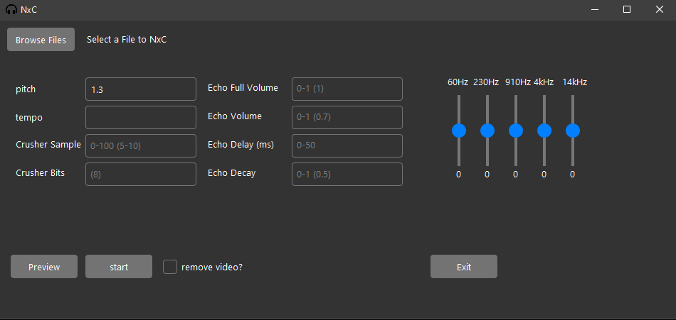

# pynxc

A front-end for ffmpeg and ffplay for applying effects to audio files.
Made with python and tkinter.

# Preview

## Effects
* pitch
* tempo
* crusher
* echo
* 5 band equalizer

## Dependencies
* ffmpeg (applying effects)
* ffplay (previewing effects)

## Key binds for Previewing Files
* 9 - decrease volume & 0 - increase volume
* w - change display mode
* q - quit

# LICENSES
* `Azure.tcl` & files in the `theme` directory are under the `MIT License`
* All else is `GPL-3.0-or-later`